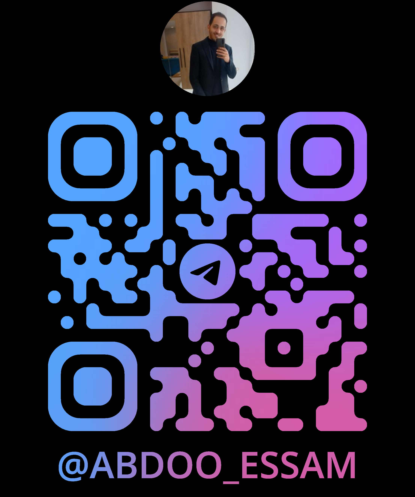
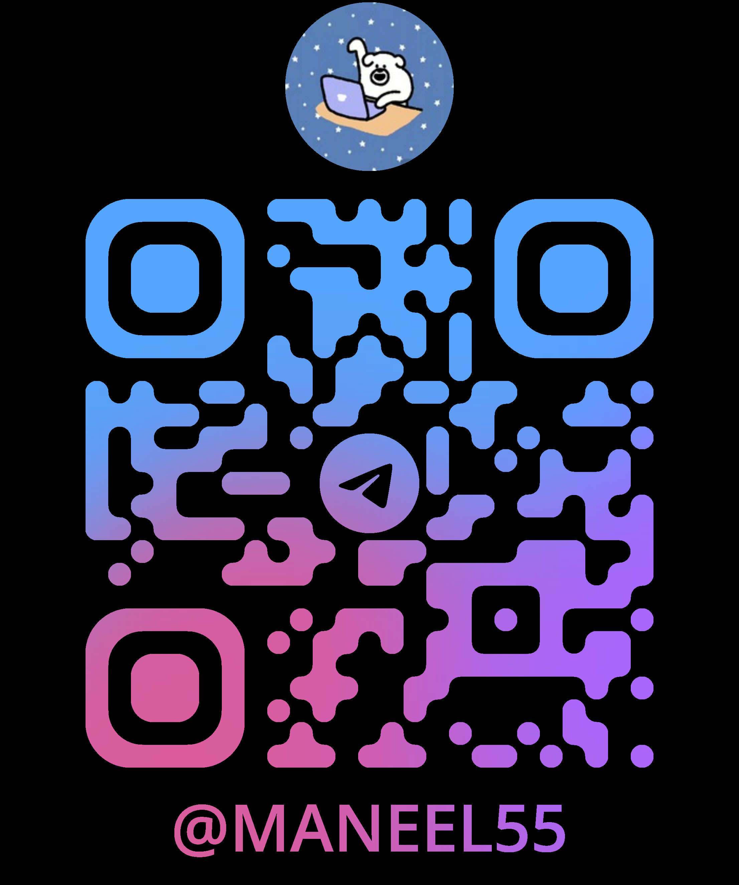
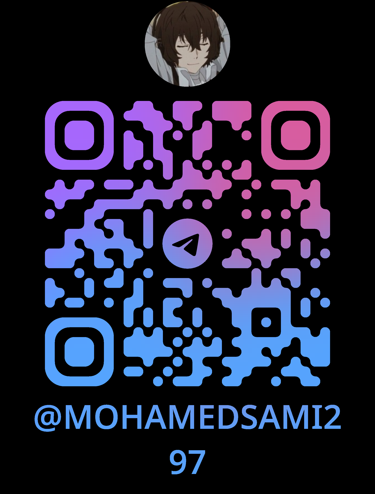
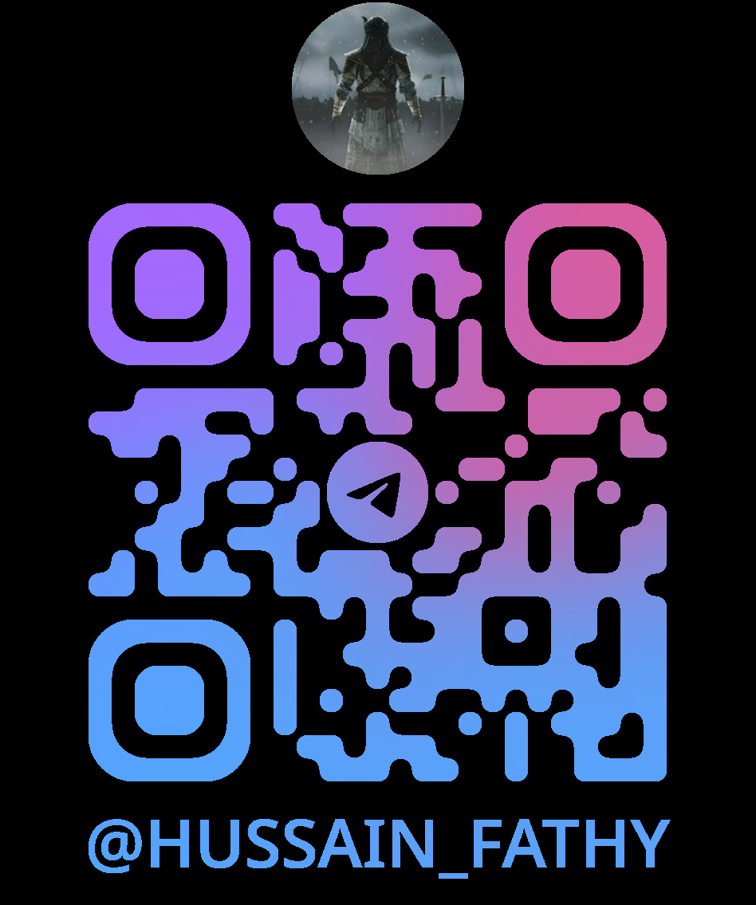

# مشروع نواة | Nawah Project

[](https://opensource.org/licenses/Apache-2.0)

## 🌟 Project Overview | نظرة عامة على المشروع

**English:**  
Nawah Project is an innovative platform that brings together developers, creators, and entrepreneurs who believe in the power of passion, knowledge, and collaboration to create meaningful impact. Our mission is to build a community where individuals can learn, develop, and innovate together, transcending the boundaries of traditional specializations.

**العربية:**  
مشروع نواة هو منصة مبتكرة تجمع المطورين والمبدعين ورواد الأعمال الذين يؤمنون بقوة الشغف والمعرفة والتعاون لخلق تأثير ذو معنى. تهدف رسالتنا إلى بناء مجتمع يمكن للأفراد من خلاله التعلم والتطوير والابتكار معًا، متجاوزين حدود التخصصات التقليدية.

## 🎯 Our Vision | رؤيتنا

**English:**  
To create a thriving ecosystem where technology, creativity, and entrepreneurship converge to drive sustainable development and innovation in the Arab world.

**العربية:**  
خلق نظام بيئي مزدهر تلتقي فيه التكنولوجيا والإبداع وريادة الأعمال لدفع عجلة التنمية المستدامة والابتكار في العالم العربي.

## 🎯 Our Mission | مهمتنا

**English:**  
Empowering individuals and teams to turn their ideas into reality through collaborative learning, mentorship, and access to resources in a supportive community environment.

**العربية:**  
تمكين الأفراد والفرق من تحويل أفكارهم إلى حقيقة من خلال التعلم التعاوني والإرشاد والوصول إلى الموارد في بيئة مجتمعية داعمة.

## 👥 Join Us | انضموا إلينا

**English:**  
Ready to be part of something bigger? Join our community of passionate individuals and start making an impact today!
Explore more about Nawah Project and join our growing community of innovators and creators.

**العربية:**  
هل أنت مستعد لتكون جزءًا من شيء أكبر؟ انضم إلى مجتمعنا من الأفراد المتحمسين وابدأ في صنع تأثير إيجابي اليوم!
استكشف المزيد عن مشروع نواة وانضم إلى مجتمعنا المتنامي من المبتكرين والمبدعين.

[](https://nawah-project.com)

## 🚀 Features

- **Responsive Design**: Works seamlessly on desktop, tablet, and mobile devices
- **Modern UI/UX**: Clean and intuitive user interface
- **Modular Structure**: Organized codebase for easy maintenance
- **Performance Optimized**: Fast loading and smooth interactions

## 🛠️ Tech Stack

- **Frontend**: HTML5, CSS3, JavaScript
- **Styling**: Custom CSS
- **Version Control**: Git

## 📦 Installation

1. Clone the repository:
   ```bash
   git clone https://github.com/maneelgitproject-art/Front-End.git
   ```
2. Navigate to the project directory:
   ```bash
   cd Front-End
   ```
3. Open `index.html` in your preferred web browser

## 🏗️ Project Structure

```
Front-End/
├── assets/          # Static assets (images, icons, etc.)
├── index/           # Main page components
├── specialties/     # Specialties section
├── join_project/    # Project participation
├── news/            # News and updates
├── overview/        # Project overview
├── social/          # Social media integration
└── support/         # Support related files
```

## 🚀 Getting Started

1. Open `index.html` in your browser to view the main page
2. Explore different sections using the navigation menu
3. For development, use a local server for best results

## 🤝 Contributing

We welcome contributions! Please follow these steps:

1. Fork the repository
2. Create a new branch (`git checkout -b feature/AmazingFeature`)
3. Commit your changes (`git commit -m 'Add some AmazingFeature'`)
4. Push to the branch (`git push origin feature/AmazingFeature`)
5. Open a Pull Request

## 📄 License

This project is licensed under the APCAHE License - see the [LICENSE](LICENSE) file for details.

## 🙏 Acknowledgments

- [NAWAH Team] for the amazing project

<table align="center" style="border: none; margin: 0 auto;">
  <tr>
    <td style="padding: 20px; margin: 0 15px; border: none; text-align: center;">
      
    </td>
    <td style="width: 80px; border: none;"></td>
    <td style="padding: 20px; margin: 0 15px; border: none; text-align: center;">
      
    </td>
    <td style="width: 80px; border: none;"></td>
    <td style="padding: 20px; margin: 0 15px; border: none; text-align: center;">
      
    </td>
  </tr>
</table>

## 📧 Contact

For any inquiries, please contact:

<table align="center" style="border: none; margin: 0 auto;">
  <tr>
    <td style="padding: 20px; margin: 0 15px; border: none; text-align: center;">
      <h2>NAWAH CEO</h2>
      
    </td>
  </tr>
</table>
